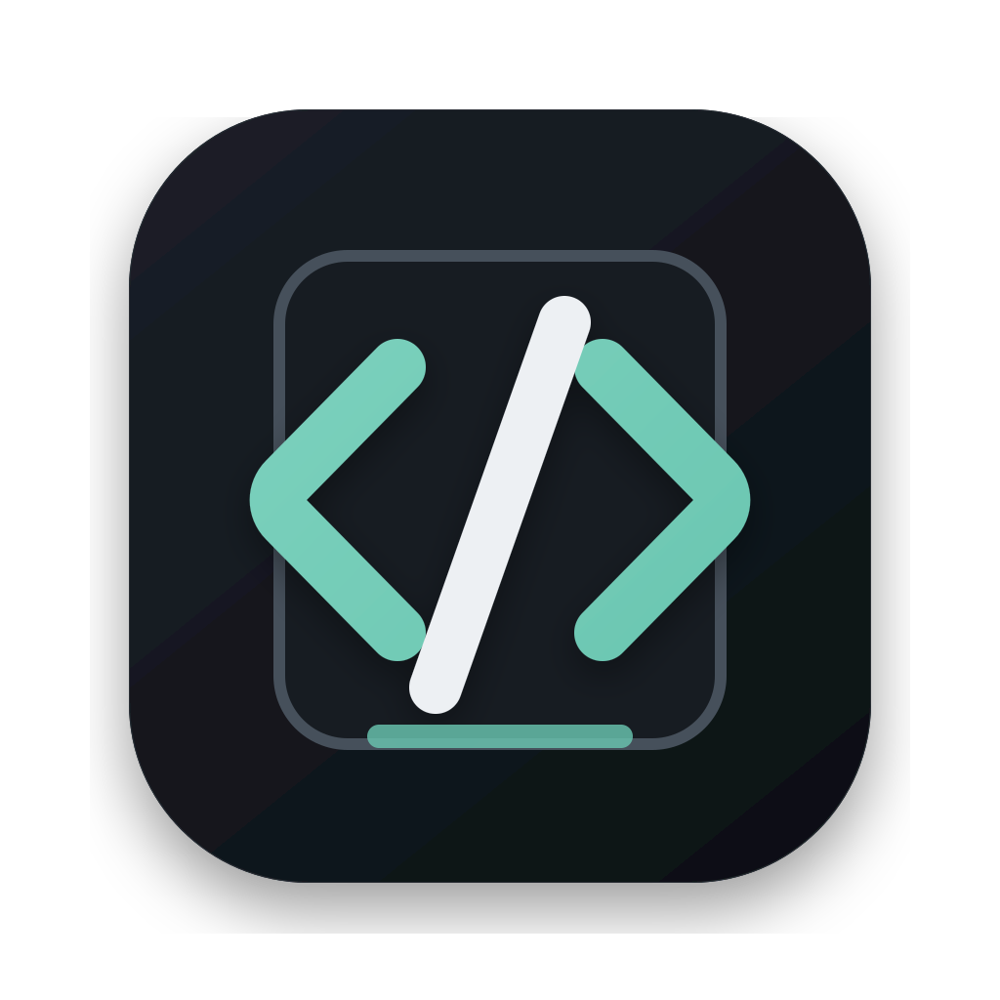

# Building a reliable coding session

A good session keeps the project context clear, makes operations reviewable, and leaves the user in control of every sensitive action.

## Text hierarchy

Markdown prose supports **strong emphasis**, _subtle emphasis_, _**combined emphasis**_, ~~superseded guidance~~, <u>underlined text</u>, H<sub>2</sub>O, and x<sup>2</sup>. Use `inline code` for commands, paths, identifiers, and short values.

Links remain visible without depending on color alone. Read the [CommonMark specification](https://commonmark.org) or jump to the [table example](#tables) below.

## Links

A named link points to a related destination: [Visit GitHub](https://github.com).

- [External link](https://commonmark.org) opens a separate destination.
- [Anchor link](#tables) moves within the same document.
- <https://www.google.com> shows an automatic URL.
- <hello@example.com> uses a mail link.

### Third-level heading

Use this level to separate closely related topics inside a larger section.

#### Fourth-level heading

Deeper headings stay distinct without competing with the document title.

##### Fifth-level heading

This level works best for compact reference material.

###### Sixth-level heading

The smallest heading is still recognizable as structure, not metadata.

---

## Lists

### Unordered and nested lists

- Open a local project.
- Create a session with the right provider.
  - Confirm the selected model.
  - Review project authority.
    - Keep external paths read-only unless explicitly approved.
- Submit the first turn.

### Ordered lists

1. Inspect the affected files.
2. Make the smallest coherent change.
   1. Verify focused behavior.
   2. Inspect the final diff.
3. Report the result and any remaining limitation.

### Task lists

- [x] Project opened
- [x] Focused checks passed
- [ ] Broader integration check pending

---

## Blockquotes

> Authority should be understandable before an operation runs, not reconstructed afterward.

> A blockquote can contain richer Markdown structures.
>
> - Lists remain readable.
> - Inline `machine values` keep their semantic treatment.
>
> > Nested quotes use quieter tonal separation.

## Code

Inline code such as `session.create` sits naturally within prose.

### JavaScript

```javascript
// Create a session for the active project
async function createSession(projectId) {
  const session = await client.sessions.create({
    projectId,
    model: "gpt-5.6-sol",
    stream: true,
  });
  return session.id;
}
```

### Java

```java
@Service
public final class SessionService {
  public Session create(String projectId) {
    var model = "gpt-5.6-sol";
    return new Session(projectId, model, true);
  }
}
```

### Go

```go
package sessions

import "context"

func Create(ctx context.Context, projectID string) (Session, error) {
  session, err := store.Create(ctx, projectID)
  if err != nil {
    return Session{}, err
  }
  return session, nil
}
```

### Rust

```rust
#[derive(Debug, Clone)]
struct Session<'a> {
  project_id: &'a str,
  ready: bool,
}

fn create_session(project_id: &str) -> Result<Session<'_>, Error> {
  tracing::info!("creating session");
  Ok(Session { project_id, ready: true })
}
```

### Python

```python
# Keep only sessions that are ready
def ready_sessions(sessions):
    return [
        session.id
        for session in sessions
        if session.status == "ready"
    ]

print(ready_sessions(sessions))
```

### Bash

```bash
# Open a project and create a session
suncode project open "./sample-project"
if suncode session create --model "gpt-5.6-sol"; then
  echo "Session ready"
fi
```

### HTML

```html
<!-- Session status -->
<section aria-label="Session status">
  <strong>Ready</strong>
</section>
```

### CSS

```css
.session-status {
  display: grid;
  gap: 8px;
  color: var(--text);
}
```

### JSON

```json
{
  "project": "suncode",
  "sessionCount": 3,
  "ready": true
}
```

## Image

Images respect the reading measure and never overflow their container.



## Tables

| Element          | Purpose                  | Support   |
| ---------------- | ------------------------ | --------- |
| **Heading**      | Document hierarchy       | Supported |
| `Code`           | Commands and identifiers | Supported |
| [Link](#tables)  | Related destinations     | Supported |
| ~~Deleted text~~ | Superseded content       | Supported |

## Extended inline elements

Press <kbd>Command</kbd> + <kbd>Enter</kbd> to submit. Use <mark>highlighted text</mark> only when the content itself calls for emphasis.

---

## Footnotes

Durable state belongs to the Rust-owned data layer.[^1]

[^1]: Clients consume the SDK contract and do not access SQLite directly.
